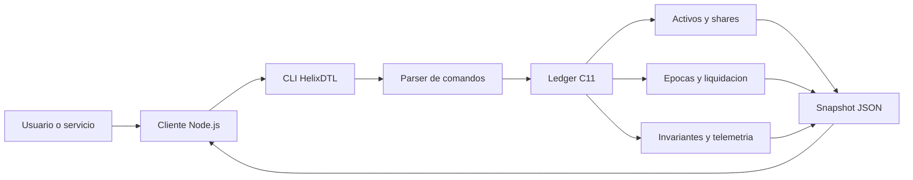
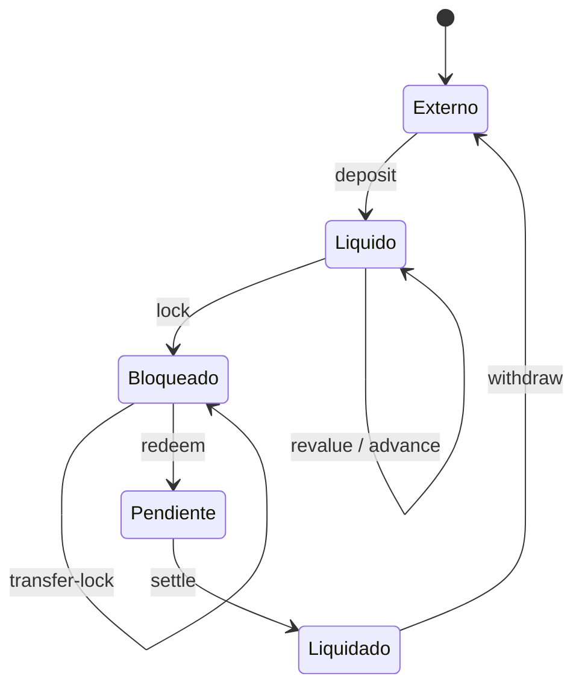
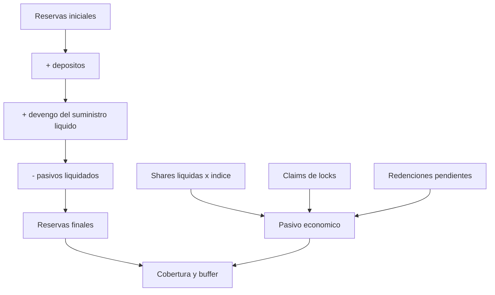
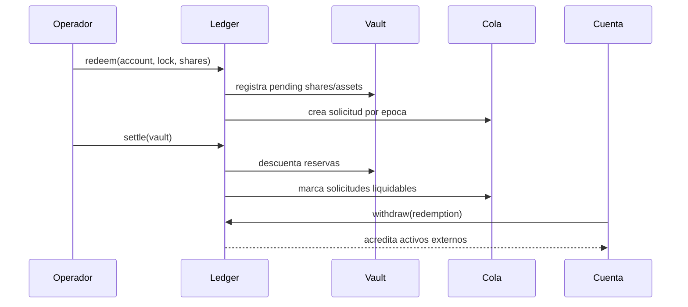

# HelixDTL


HelixDTL es un motor determinista de contabilidad para vault shares con
liquidacion por epocas. El nucleo C11 administra activos, shares liquidas,
posiciones bloqueadas, transferencias internas, solicitudes de redencion y
retiros; el cliente Node.js aporta una interfaz inmutable para integrar el
binario en servicios de tesoreria, indexadores y procesos de conciliacion.

La version `Production 1.0.0` prioriza aritmetica entera reproducible, snapshots
JSON estables, transiciones acotadas y observabilidad economica. No depende de
servicios externos ni de estado no determinista.

## Arquitectura



El estado se separa en seis dominios: cuentas, vaults, posiciones liquidas,
locks, redenciones y eventos. Los identificadores son monotonos por entidad y
las cantidades monetarias usan enteros de 64 bits. El indice de share tiene una
escala fija de `1_000_000`.



## Modelo Economico

Para un indice `I`, shares `S` y escala `Q = 1_000_000`:

```text
shares_minted = floor(assets * Q / I)
assets_value  = floor(shares * I / Q)
live_assets   = floor(live_shares * share_index / Q)
```

Una revalorizacion aplica el nuevo indice exclusivamente al suministro liquido
y contabiliza la diferencia como activos devengados. Los locks conservan sus
propios indices contables; las redenciones pasan primero a pasivo pendiente y
solo se convierten en activos retirables al ejecutar `settle`.



El modulo `Exit Risk` proyecta simultaneamente recortes, haircut de liquidez,
run de redenciones, recuperacion de backstop y concentracion. Devuelve cobertura
del sistema, cobertura de cola, necesidad de capital y una banda operativa:
`normal`, `watch`, `restricted` o `critical`.

## Ciclo De Liquidacion



`settle` procesa de forma atomica todas las redenciones elegibles del vault. Si
las reservas no cubren el total, el ledger conserva el importe no cubierto como
deficit y eleva el estado de insolvencia en el snapshot.

## Componentes

| Ruta | Responsabilidad |
| --- | --- |
| `include/helix.h` | API, entidades y limites del ledger |
| `include/helix_risk.h` | Contrato del modelo de riesgo y sus politicas |
| `src/ledger.c` | Transiciones de activos, shares, locks y liquidacion |
| `src/risk.c` | Proyeccion de cobertura, liquidez y concentracion |
| `src/codec.c` | Serializacion JSON y digest determinista |
| `src/script.c` | Lenguaje lineal `.hlx` |
| `client/helix-client.mjs` | Cliente Node.js, validacion y vistas agregadas |
| `tests/` | Pruebas C, integracion Node.js y contratos del CLI |

## Requisitos

- Node.js 24 o posterior.
- npm 11 o posterior.
- Un compilador C11: GCC, Clang o MSVC.

En Windows, `scripts/build.mjs` localiza Visual Studio Build Tools mediante
`vswhere` y entra automaticamente en el entorno x64 cuando es necesario.

## Inicio Rapido

```bash
npm ci
npm run build
npm test
npm run test:c
npm run ci
```

Listar y ejecutar escenarios operativos:

```bash
build/helixdtl --list
build/helixdtl basic
build/helixdtl multi
```

En Windows el ejecutable es `build/helixdtl.exe`.

## Lenguaje `.hlx`

Cada linea representa una transicion. Los comentarios comienzan con `#`:

```text
network treasury-eu
account 1 alice 250000
account 2 bob 180000
vault 7 hxSOL 1.000000
deposit 1 7 100000
lock 1 7 30000
quote-redeem 1 1 10000
redeem 1 1 10000
settle 7
withdraw 1 1
snapshot
```

La referencia completa esta en [docs/integracion-cli-sdk.md](./docs/integracion-cli-sdk.md).

## Cliente Node.js

```js
import { HelixClient } from "./client/helix-client.mjs";

const client = new HelixClient();
const snapshot = client.runScenario("basic");
const portfolio = HelixClient.accountPortfolio(snapshot, 1);
const riskInput = HelixClient.vaultRiskInput(snapshot, 7, {
    backstopAssets: 25_000,
});
```

El cliente valida el contrato JSON, restringe nombres y archivos, elimina los
temporales de forma garantizada y devuelve errores tipados con estado y payload.

## Garantias Operativas

- C11 con `-Wall -Wextra -Werror` o `/W4 /WX`.
- Compilacion y pruebas en Ubuntu y Windows.
- Formato JavaScript verificado con Prettier.
- Pruebas unitarias del modelo de riesgo y pruebas de integracion del CLI.
- Digest FNV-1a estable para una misma secuencia.
- Verificacion automatica de fuentes economicas, documentacion y release.
- `main`, `production` y el tag publicado deben identificar el mismo commit.

## Documentacion

- [Arquitectura](./docs/arquitectura.md)
- [Modelo economico](./docs/modelo-economico.md)
- [Epocas e indices](./docs/epocas-indices.md)
- [Locks y redenciones](./docs/locks-redenciones.md)
- [Riesgo y solvencia](./docs/riesgo-solvencia.md)
- [Operacion](./docs/operacion.md)
- [Integracion CLI y SDK](./docs/integracion-cli-sdk.md)
- [Politica de seguridad](./SECURITY.md)

## Release

`v1.0.0` corresponde al canal `production`. El metadato verificable se conserva
en `RELEASE.json`; el proceso de publicacion exige CI verde en la rama candidata,
`main`, `production`, el tag anotado y el evento de GitHub Release.

## Licencia

MIT. Consulta [LICENSE](./LICENSE).
