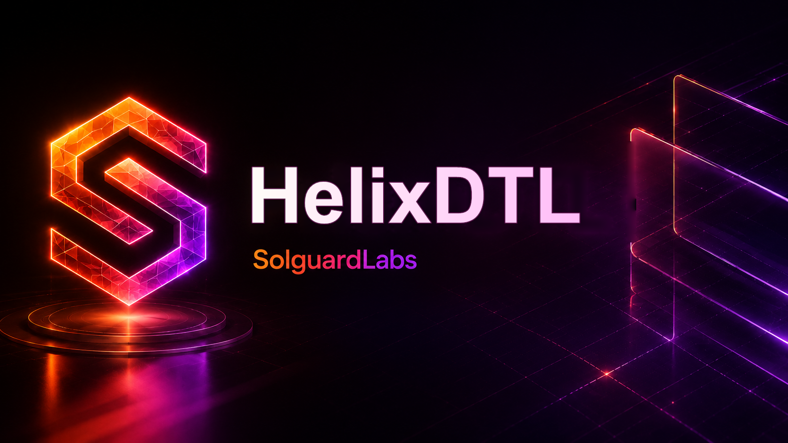

# HelixDTL



HelixDTL es un CTF de vault shares DTL escrito en C. Modela depositos,
shares liquidas, locked shares, redenciones pendientes y liquidacion por epoch.
El repositorio incluye un binario CLI determinista y tests JavaScript que
ejercitan usuarios normales, multiples vaults, cambios de indice y redenciones
parciales.

El lab contiene una vulnerabilidad intencional de severidad critica: una
transferencia interna de locked shares despues de un cambio de epoch puede
separar el `issued_index` real del `redemption_index` usado para cotizar la
redencion. En determinadas secuencias, el vault liquida mas reservas de las que
corresponden a la participacion real.

## Estructura

- `include/helix.h`: API publica y estructuras del ledger.
- `src/amount.c`: conversion fija entre assets, shares e indices.
- `src/ledger.c`: reglas de negocio de depositos, locks, transferencias,
  redenciones y settlement.
- `src/codec.c`: snapshots JSON deterministas y digest de estado.
- `src/script.c`: runner de scripts lineales `.hlx`.
- `src/scenarios.c`: escenarios de referencia.
- `src/invariants.c`: reporte contable derivado para snapshots.
- `src/query.c`: consultas auxiliares para auditoria y writeups.
- `src/quote.c`: preflight quotes de depositos y redenciones sin mutar estado.
- `tests/node`: tests de integracion con `node:test`.
- `docs/PROTOCOL.md`: descripcion de entidades y transiciones.
- `docs/INVARIANTS.md`: invariantes que los tests sanos esperan preservar.
- `docs/SCENARIOS.md`: guia de escenarios integrados.
- `docs/SCRIPTING.md`: referencia del lenguaje `.hlx`.
- `examples`: scripts manuales de ejemplo.

## Requisitos

- Node.js 24 o superior.
- Un compilador C11 en `PATH`: `cc`, `gcc`, `clang` o `cl`.

En Windows, si usas MSVC, abre una Developer PowerShell de Visual Studio para
que `cl` este disponible. Tambien puedes fijar `HELIX_CC`:

```bash
HELIX_CC=clang node scripts/build.mjs
```

## Comandos

```bash
npm install
npm run build
npm test
npm run check:js
npm run ci
```

Tambien hay un `Makefile` para entornos POSIX:

```bash
make
make test
```

## CLI

Listar escenarios:

```bash
build/helixdtl --list
```

Ejecutar un escenario:

```bash
build/helixdtl basic
build/helixdtl multi
build/helixdtl index
build/helixdtl partial
build/helixdtl transfer
build/helixdtl snapshot
```

Ejecutar un script:

```bash
build/helixdtl run examples/safe_flow.hlx
```

En Windows el binario generado es `build/helixdtl.exe`.

## Lenguaje de scripts

Cada linea ejecuta una transicion. Los ids son numericos y los objetos creados
usan ids secuenciales por tipo: locks desde `1`, redenciones desde `1`.

```text
network <network_id>
account <id> <label> <assets>
vault <id> <symbol> <share_index>
deposit <account_id> <vault_id> <assets>
lock <account_id> <vault_id> <shares>
transfer-lock <from_account_id> <to_account_id> <lock_id> <shares>
revalue <vault_id> <share_index>
advance <vault_id>
redeem <account_id> <lock_id> <shares>
quote-deposit <account_id> <vault_id> <assets>
quote-redeem <account_id> <lock_id> <shares>
settle <vault_id>
withdraw <account_id> <redemption_id>
snapshot
```

Los indices tienen seis decimales fijos (`1.000000`, `1.250000`,
`2.100000`). Los comentarios empiezan con `#`.

## Salida JSON

El CLI devuelve un snapshot JSON con:

- `accounts`, `vaults`, `positions`, `locks`, `redemptions` y `events`.
- `quotes`, con estimaciones preflight creadas por scripts.
- `account_views` y `vault_views`, con agregados utiles para auditoria.
- `state_digest`, estable para una misma secuencia.
- `totals.deficit_assets`, reservas que no pudieron cubrirse.
- `totals.excess_quote_assets`, assets cotizados por encima del indice emitido.
- `risk.insolvent_vaults` y `risk.has_excess_quote`.

La condicion de exito del CTF es construir una secuencia que genere
`risk.has_excess_quote = true` o `risk.insolvent_vaults > 0` usando solo
transiciones validas del protocolo.

Los escenarios sanos funcionan como contrato publico del comportamiento normal.
El escenario vulnerable queda disponible para diagnostico y writeups.

## Nota de seguridad

Este codigo es deliberadamente vulnerable. No debe usarse como base de un
vault real sin corregir la separacion de indices, revisar los invariantes y
anadir pruebas de regresion contra redenciones cruzadas.
