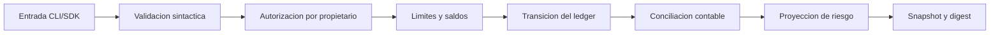
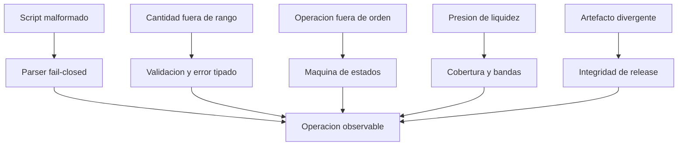

# Politica De Seguridad

## Versiones Mantenidas

| Version | Canal | Estado |
| --- | --- | --- |
| `1.0.x` | `production` | Mantenida |
| `< 1.0.0` | historico | Sin mantenimiento |

La referencia operativa es el tag anotado mas reciente cuyo commit coincide con
las ramas `main` y `production`.

## Principios De Seguridad

HelixDTL aplica defensa por capas al ciclo completo: entrada estricta, limites de
capacidad, aritmetica entera, transiciones atomicas, snapshot determinista,
invariantes contables y una proyeccion independiente de solvencia.

El modelo asume que el proceso que invoca el binario autentica al actor y
protege los archivos `.hlx`. El ledger valida propiedad, existencia, saldo,
shares, indice, capacidad y estado de cada entidad antes de mutar memoria.

## Superficies Protegidas

- conversion entre activos y shares con escala fija;
- propiedad y subdivisiones de locks;
- orden `request -> settle -> withdraw`;
- independencia de vaults y epocas;
- conciliacion entre reservas, pasivos y deficit;
- parser de scripts, nombres simples y limites de linea;
- serializacion JSON y digest de estado;
- ejecucion de subprocesos desde el cliente Node.js;
- artefactos, ramas y tags de publicacion.

## Modelo De Amenazas

El modelo no sustituye controles de proceso como aislamiento del host, gestion
de secretos, firma de artefactos o autenticacion del servicio que exponga el
CLI. Esos controles pertenecen a la plataforma de despliegue.

## Comunicacion Responsable

Abre un aviso privado desde la seccion **Security** del repositorio. Incluye:

- version, commit y sistema operativo;
- secuencia minima reproducible;
- estado inicial y snapshot resultante;
- impacto contable o de disponibilidad;
- propuesta de contencion, si existe.

No publiques detalles tecnicos antes de que exista una version corregida. El
acuse de recibo objetivo es de dos dias laborables; la clasificacion inicial,
de cinco dias laborables. Los plazos de correccion dependen del impacto y de la
complejidad de migracion del estado.

## Criterios De Severidad

| Nivel | Ejemplos |
| --- | --- |
| Critico | perdida material de reservas, retiro no autorizado o insolvencia |
| Alto | alteracion persistente del ledger o bloqueo amplio de retiros |
| Medio | degradacion acotada con recuperacion operativa |
| Bajo | endurecimiento sin impacto economico directo |

## Controles De Publicacion

Antes de promover una version:

1. ejecutar `npm ci` y `npm run ci` desde un checkout limpio;
2. verificar que no hay pruebas privadas ni temporales versionados;
3. comprobar identidad de la logica economica protegida;
4. exigir CI verde en Ubuntu y Windows;
5. fusionar por pull request y validar de nuevo `main`;
6. fijar `production` al mismo commit;
7. crear un tag anotado y una release no preliminar;
8. comprobar que los tres commits pelados coinciden.

## Operacion Segura

- Ejecuta el binario con un usuario sin privilegios.
- Monta scripts de entrada como solo lectura cuando procedan de un plan aprobado.
- Conserva snapshots y digests para conciliacion posterior.
- Aplica limites externos de CPU, memoria y tamano de archivo.
- No uses datos sensibles en labels, simbolos o nombres de red.
- Deten nuevas operaciones si la banda de riesgo es `restricted` o `critical`.
- Revisa deficit, cobertura de cola y concentracion antes de cada `settle`.

## Dependencias

El nucleo de produccion no enlaza bibliotecas de terceros. Node.js se usa para
compilacion, pruebas y cliente; Prettier es la unica dependencia de desarrollo.
Las actualizaciones se revisan mediante pull request y deben mantener las mismas
puertas de compilacion y test.
