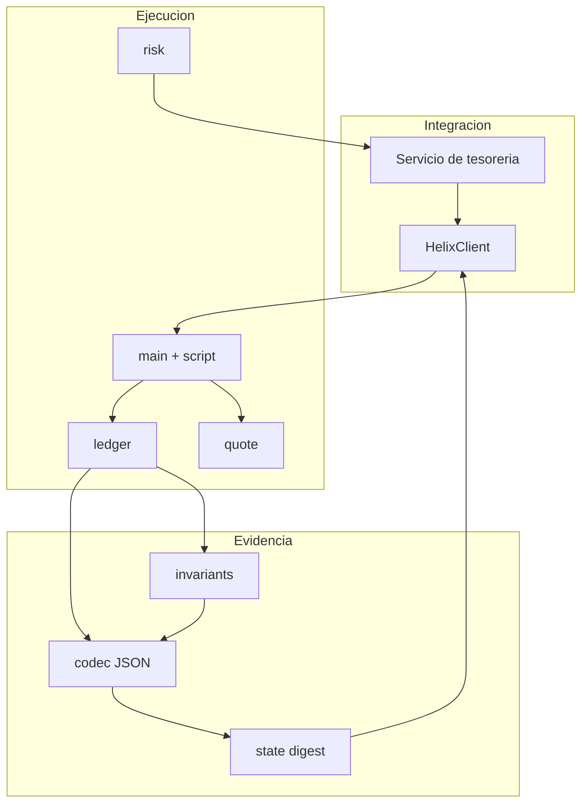
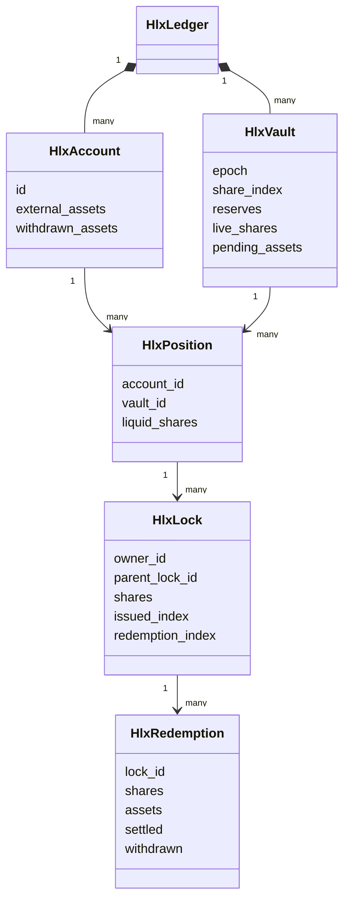
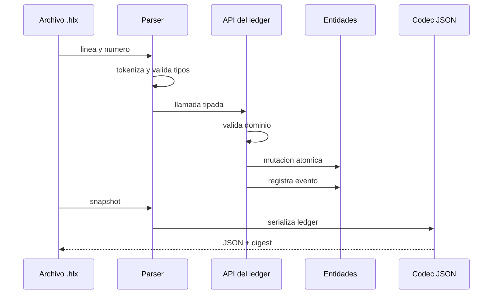

# Arquitectura

## Objetivo Del Sistema

HelixDTL separa el motor economico de la capa de integracion. El proceso C11 es
la autoridad del estado; el CLI traduce comandos, y el cliente Node.js valida y
agrega las respuestas sin mutarlas. Esta separacion permite reproducir una
secuencia con el mismo resultado en Windows y Linux.

## Dominios De Estado

`HlxLedger` contiene arrays de capacidad fija. No existen punteros persistentes,
asignacion dinamica ni I/O dentro de las reglas economicas. Cada entidad incluye
un indicador `active`; los ids se asignan de forma monotona y nunca se reutilizan
durante la vida del proceso.

## Ruta De Una Orden

El parser valida aridad y tipos antes de llamar a la API. La API vuelve a
validar existencia, propiedad, capacidad y cantidades. Solo despues actualiza
las entidades relacionadas y emite un evento.

## Limites

Los limites (`HLX_MAX_*`) forman parte del contrato. Una operacion que agotaria
una tabla devuelve `HLX_ERR_CAPACITY` y no debe reintentarse sin rotar el
proceso o compactar el estado en una version futura. Los labels y simbolos se
truncan a su tamano maximo mediante escritura acotada.

## Extensibilidad

Nuevos comandos deben seguir cuatro pasos: declarar la funcion en el header,
implementar una transicion autocontenida, exponerla en `script.c` y agregar
pruebas de caso valido, rechazo y snapshot. Una vista observacional no debe
escribir en `HlxLedger`.
