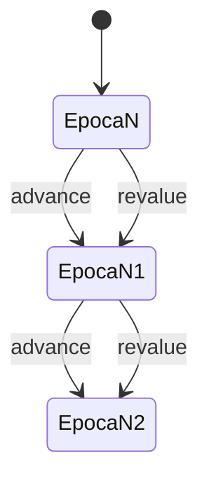
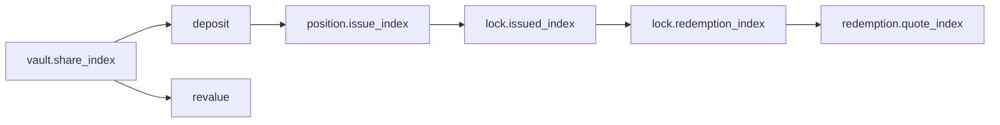
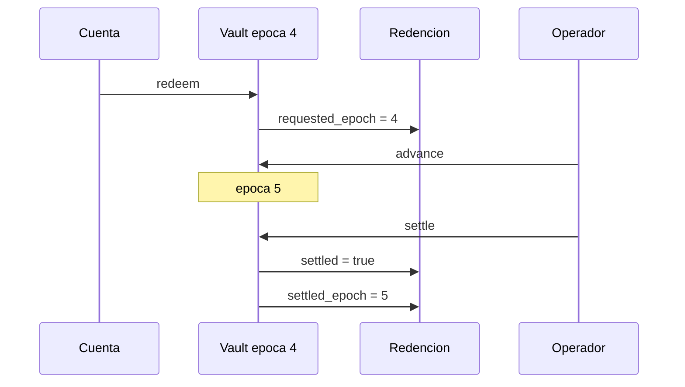

# Epocas E Indices

## Dominio Temporal

Cada vault posee una epoca independiente. `advance` incrementa la epoca sin
cambiar el indice; `revalue` cambia ambos. Esto permite separar ventanas de
liquidacion de los cambios economicos del activo subyacente.

## Indices Contables

| Campo | Ambito | Uso |
| --- | --- | --- |
| `vault.share_index` | vault | depositos, suministro liquido y revalorizacion |
| `vault.previous_index` | vault | trazabilidad del ultimo cambio |
| `position.issue_index` | posicion | coste medio de shares liquidas |
| `lock.issued_index` | lock | valor contable de origen |
| `lock.redemption_index` | lock | indice aplicable a la solicitud |
| `redemption.quote_index` | redencion | evidencia congelada de la cotizacion |

## Orden De Corte

Una solicitud registra `requested_epoch`. `settle` solo incluye solicitudes del
vault con una epoca de solicitud menor o igual a la epoca actual. El estado
`settled_epoch` permite auditar en que corte se materializo el pasivo.

## Reglas Operativas

- No reutilizar ids entre epocas.
- No ejecutar `revalue` con indice cero.
- Conciliar `previous_index` y `share_index` en cada cambio.
- Agrupar `settle` por vault, nunca por una epoca global.
- Conservar el snapshot anterior y posterior a cada corte.
- Revisar devengo, deficit y pasivos antes de aceptar una nueva epoca.

## Observabilidad

Los eventos incluyen epoca, cuenta, vault, importe y una nota estable. Para una
auditoria temporal, ordena primero por `serial`, no por id de entidad.
