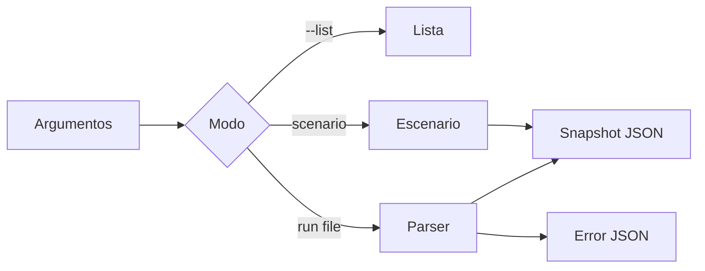
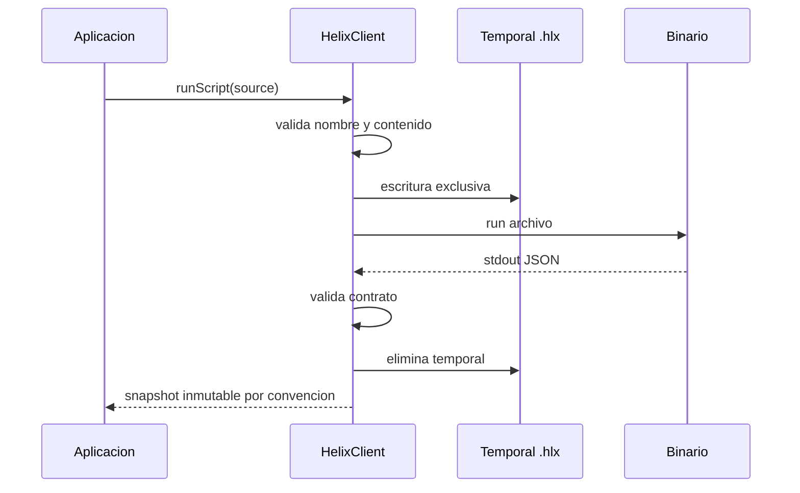
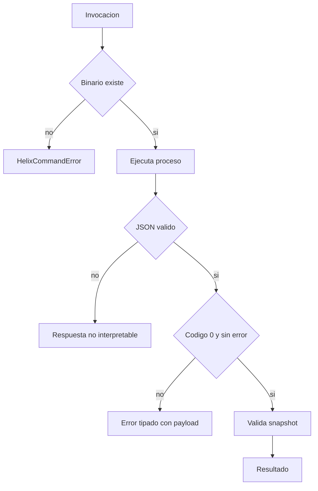

# Integracion CLI Y SDK

## Contrato Del CLI

El binario ofrece escenarios deterministas, listado y ejecucion de scripts:

```bash
build/helixdtl --list
build/helixdtl basic
build/helixdtl run operations.hlx
```

En exito devuelve un unico objeto JSON por stdout y codigo `0`. En error devuelve
un objeto con `error`, `detail` y `line`, y codigo distinto de cero.



## Comandos `.hlx`

| Comando | Argumentos |
| --- | --- |
| `network` | `network_id` |
| `account` | `id label assets` |
| `vault` | `id symbol share_index` |
| `deposit` | `account_id vault_id assets` |
| `lock` | `account_id vault_id shares` |
| `transfer-lock` | `from_id to_id lock_id shares` |
| `quote-deposit` | `account_id vault_id assets` |
| `quote-redeem` | `account_id lock_id shares` |
| `redeem` | `account_id lock_id shares` |
| `revalue` | `vault_id share_index` |
| `advance` | `vault_id` |
| `settle` | `vault_id` |
| `withdraw` | `account_id redemption_id` |
| `snapshot` | sin argumentos |



## Uso Del Cliente

```js
import { HelixClient, HelixCommandError } from "./client/helix-client.mjs";

const client = new HelixClient({
    binary: process.env.HELIX_BIN,
});

try {
    const state = client.runScenario("multi");
    const alice = HelixClient.accountPortfolio(state, 1);
    const vault = HelixClient.vaultRiskInput(state, 7, {
        backstopAssets: 50_000,
    });
    console.log({ alice, vault });
} catch (error) {
    if (error instanceof HelixCommandError) {
        console.error(error.status, error.payload);
    }
    throw error;
}
```

## Gestion De Errores



No construyas comandos mediante shell ni interpolacion. `HelixClient` usa
`spawnSync` con array de argumentos y un archivo temporal de nombre restringido.

## Compatibilidad

El cliente exige `index_scale = 1_000_000`, digest hexadecimal de 16 caracteres
y arrays para las colecciones principales. Un cambio incompatible requiere una
nueva version mayor y pruebas de migracion del consumidor.
