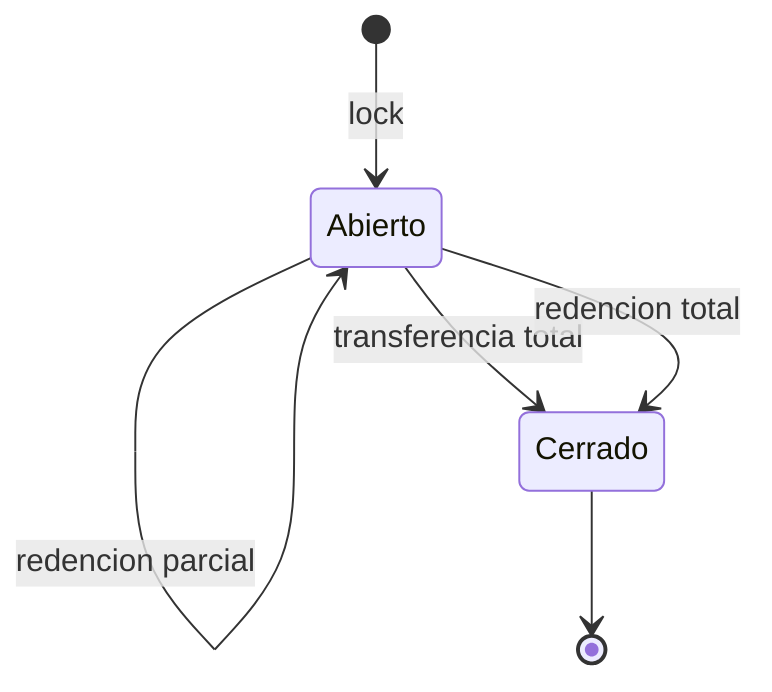
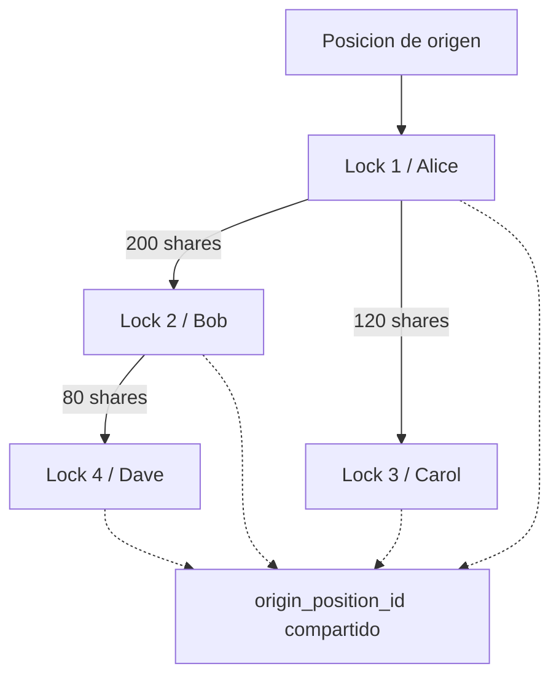
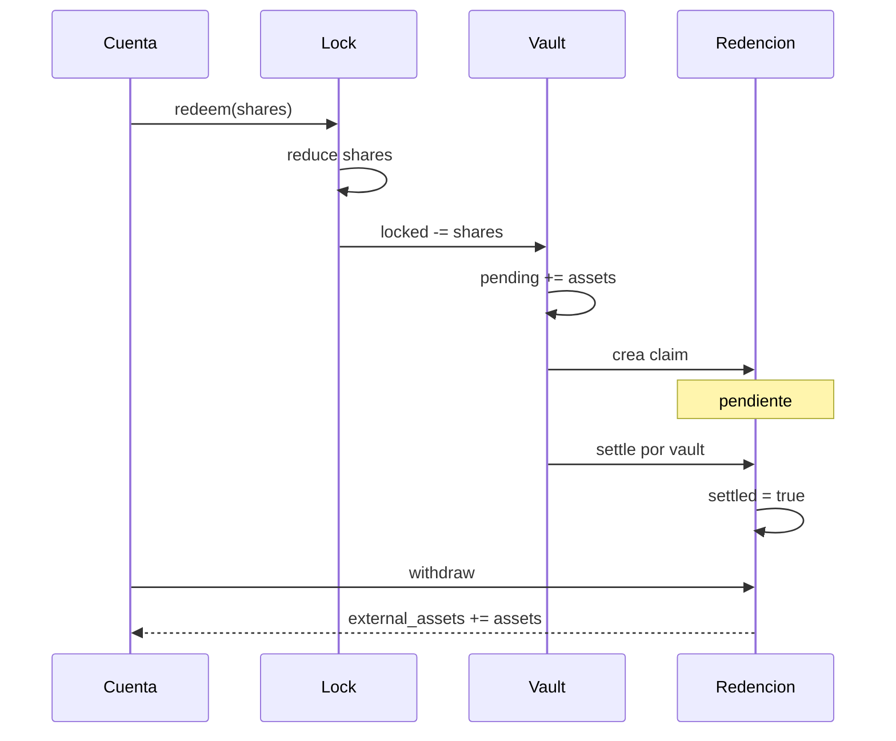

# Locks Y Redenciones

## Ciclo De Una Posicion Bloqueada

Un lock retira shares del suministro liquido y conserva origen, propietario,
vault, epoca, profundidad de transferencia e indices. Puede consumirse mediante
redenciones parciales o dividirse al transferir parte de sus shares.

El lock fuente reduce `shares`; el hijo recibe un id nuevo, `parent_lock_id`,
`transfer_depth + 1` y el mismo origen. La suma de shares de fuente e hijo debe
ser igual al saldo previo a la transferencia.

## Propiedad Y Linaje

Una cuenta solo puede transferir o redimir un lock abierto del que sea
propietaria. La transferencia no altera `vault.locked_shares`; solo cambia la
distribucion interna. Cerrar un lock tampoco elimina su registro, de modo que el
linaje permanece auditable.

## Redencion Y Settlement

Una redencion captura shares, indices, activos y epocas. `withdraw` exige
propietario correcto, estado `settled` y ausencia de un retiro anterior.

## Ejemplo De Subdivision

Si un lock de `900` shares transfiere `300`, quedan dos posiciones: fuente con
`600` e hijo con `300`. Una redencion parcial de `100` sobre el hijo deja `200`;
el total bloqueado del vault cae a `800` y `100` pasan a `pending_shares`.

## Invariantes

- `source_after + child = source_before` en una transferencia.
- `redeemed_shares + shares` conserva el total historico del lock.
- `locked_shares` solo cambia al crear locks o solicitar redenciones.
- `pending_shares` cae al liquidar y aumenta `retired_shares`.
- una redencion retirada no puede volver a acreditarse.
- ids y linaje permanecen estables tras el cierre.
