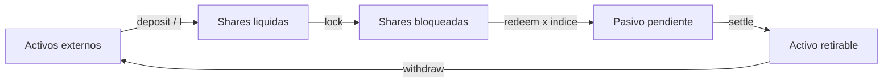
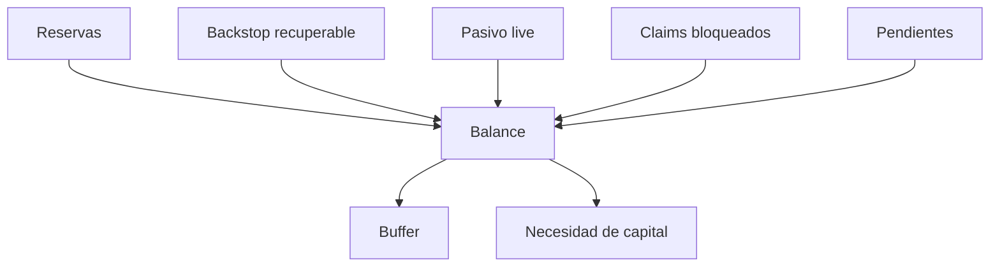
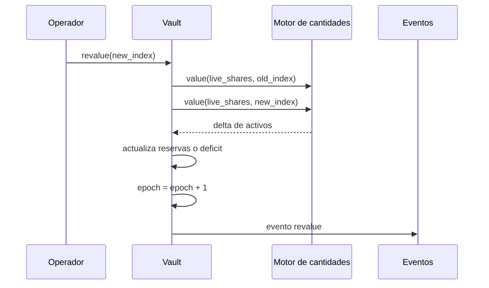

# Modelo Economico

## Unidades Y Redondeo

Activos y shares se expresan como enteros. El indice usa seis decimales y la
escala `Q = 1_000_000`. Las conversiones redondean hacia abajo para no crear
unidades fraccionarias:

```text
shares = floor(assets * Q / index)
assets = floor(shares * index / Q)
```

El llamador debe escoger una unidad base suficientemente pequena para que el
redondeo sea economicamente irrelevante y suficientemente grande para evitar
desbordamientos en productos intermedios.



## Balance Del Vault

El balance economico distingue reservas observadas y pasivos derivados:

```text
live_liability   = floor(live_shares * share_index / Q)
locked_liability = suma(floor(lock.shares * lock.issued_index / Q))
total_liability  = live_liability + locked_liability + pending_assets
capital_gap      = max(total_liability - effective_reserves, 0)
buffer           = max(effective_reserves - total_liability, 0)
```



## Revalorizacion

`revalue` cambia el indice del vault, incrementa la epoca y calcula la variacion
del suministro liquido. Un aumento suma el devengo a reservas; una caida resta
reservas y, si no bastan, registra deficit. Las operaciones posteriores usan la
nueva epoca como dominio contable.



## Ejemplo

Con `1.200` shares liquidas y un indice que pasa de `1.000000` a `1.100000`, el
pasivo liquido aumenta de `1.200` a `1.320`. HelixDTL registra `120` activos de
devengo y eleva las reservas en la misma cantidad.

## Reconciliacion

Un cierre operativo debe comparar reservas, pasivos pendientes, activos ya
liquidados y retiros. El digest identifica la secuencia, pero no reemplaza el
snapshot completo ni el log de eventos.
