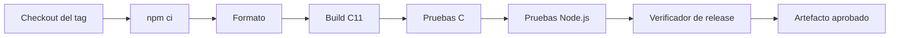
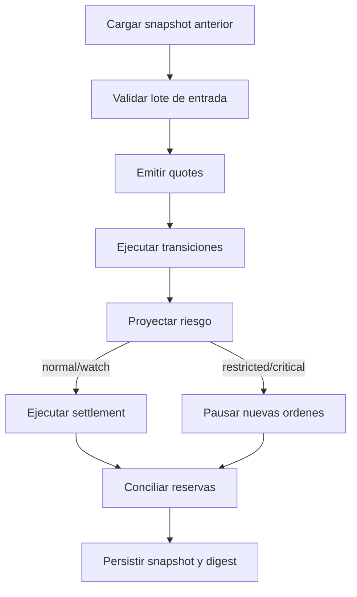
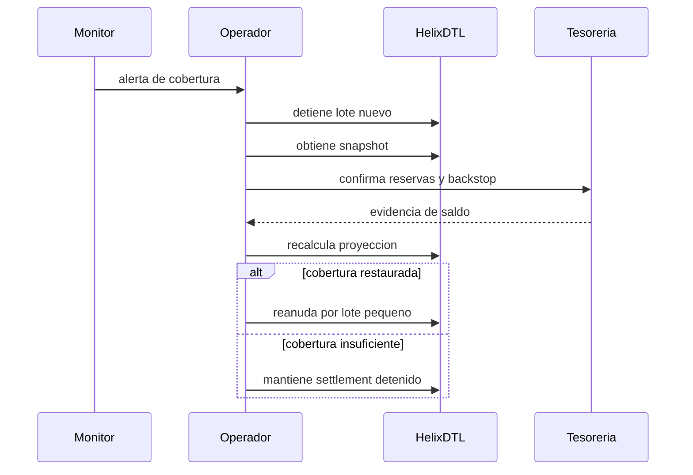

# Operacion

## Preparacion

La distribucion se construye desde un tag anotado. El host necesita Node.js 24,
npm 11 y un compilador C11. El binario no requiere dependencias dinamicas del
proyecto durante su ejecucion.



Comandos de aceptacion:

```bash
npm ci
npm run ci
python scripts/verify_release.py
```

## Ciclo Diario



Antes de `settle`, revisa reservas, pasivos pendientes, cobertura de cola,
concentracion y backstop confirmado. Despues, compara el total liquidado con el
lote aprobado y archiva los eventos nuevos.

## Observabilidad

Metricas minimas:

- reservas y deficit por vault;
- shares liquidas, bloqueadas, pendientes y retiradas;
- activos pendientes y liquidados;
- cobertura de sistema y de cola;
- mayor participacion sobre el suministro liquido;
- banda de riesgo y capital requerido;
- numero de locks abiertos y profundidad maxima;
- digest de estado y ultimo serial de evento.

## Respuesta Operativa



No edites manualmente un snapshot para recuperar operacion. Reproduce la
secuencia desde el ultimo digest aceptado y aplica una transicion aprobada.

## Backup Y Restauracion

Conserva por corte: archivo de comandos, stdout JSON, stderr, codigo de salida,
version del binario y SHA-256 del artefacto. La restauracion se valida cuando la
repeticion produce el mismo `state_digest`.

## Rollback

Un rollback de binario no implica rollback de estado. Antes de usar una version
anterior, valida compatibilidad de entidades, limites y contrato JSON. Si no hay
compatibilidad documentada, crea una migracion explicita y conserva ambos
digests.
