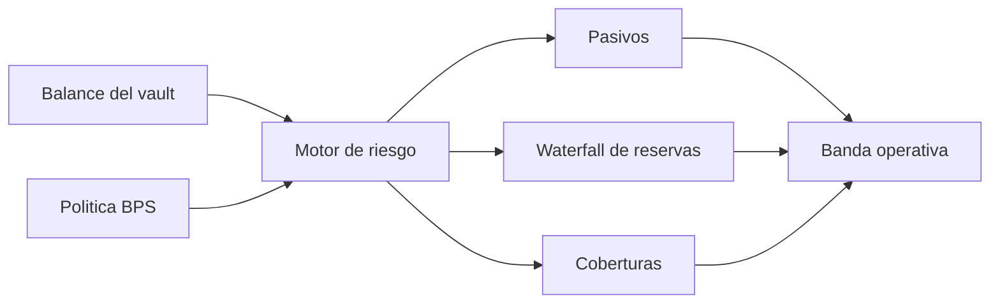
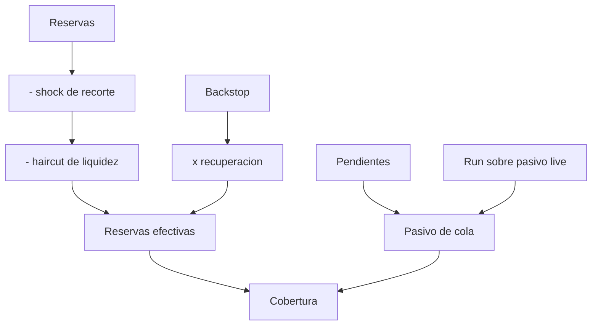
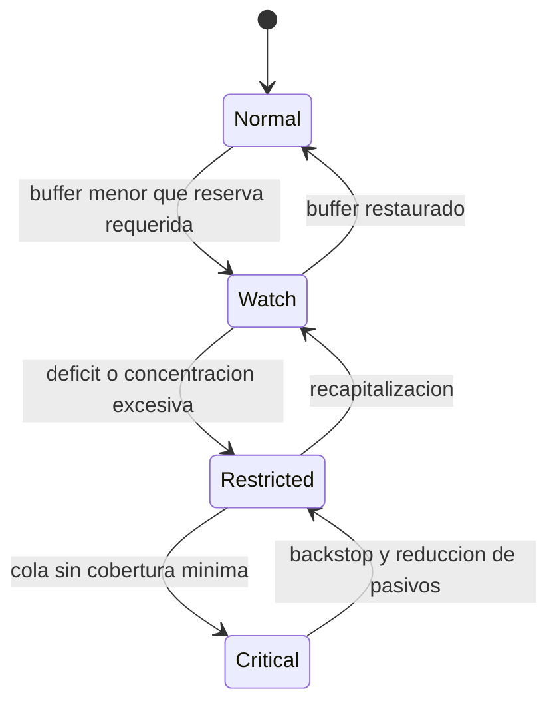

# Riesgo Y Solvencia

## Proyeccion Independiente

`hlx_risk_project` es una funcion pura: recibe balance y politica, valida rangos
y devuelve una proyeccion sin modificar el ledger. Los porcentajes usan puntos
basicos (`10.000 = 100 %`) y la aritmetica falla de forma cerrada ante un rango
no representable.



## Waterfall De Estres

```text
slash_loss          = reserves * slash_bps / 10_000
post_slash          = reserves - slash_loss
liquidity_loss      = post_slash * haircut_bps / 10_000
recovered_backstop  = backstop * recovery_bps / 10_000
effective_reserves  = post_slash - liquidity_loss + recovered_backstop
queue_liability     = pending + live_liability * run_bps / 10_000
```



## Bandas



| Banda | Condicion dominante | Accion |
| --- | --- | --- |
| `normal` | cola cubierta y buffer suficiente | operacion ordinaria |
| `watch` | buffer bajo | limitar crecimiento y aumentar reserva |
| `restricted` | deficit agregado o concentracion | detener nuevas entradas |
| `critical` | cola por debajo del umbral | detener settlement y activar backstop |

## Ejemplo

Para `2.500` reservas, `2.000` de pasivo, shock del 10 %, haircut del 5 % y
recuperacion de `250` del backstop:

```text
post_slash         = 2.250
liquidity_loss     =   112
effective_reserves = 2.388
buffer             =   388
```

Con reserva requerida de `200`, cola totalmente cubierta y concentracion del
40 %, la banda es `normal`.

## Integracion

`HelixClient.vaultRiskInput` deriva reservas, shares, indice, claims de locks,
pendientes y mayor posicion de un snapshot validado. El backstop se aporta de
forma explicita para evitar asumir capital externo no confirmado.
